Multivariable calculus students used their knowledge of parametric
surfaces to code these models in 3D.

You can see their code and interact with their models 
[here at Dr. Kessner's Parametric Playground](https://dkessner.github.io/ParametricPlayground/).
(click the "Student Examples" button).

Ashley '23:
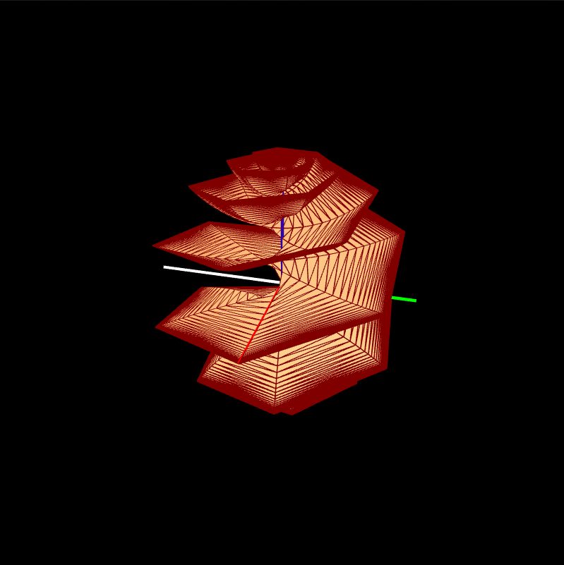  

Ava '22:
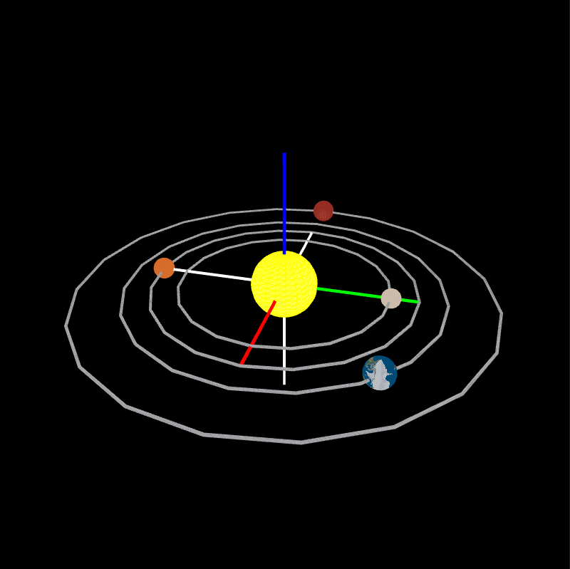

Charlotte '22:
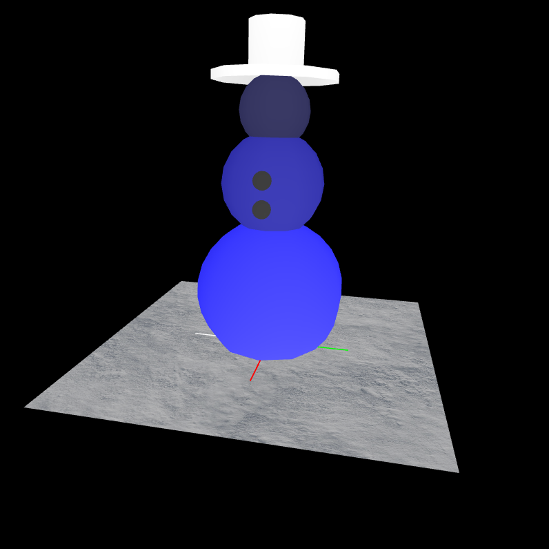

Delia '22:
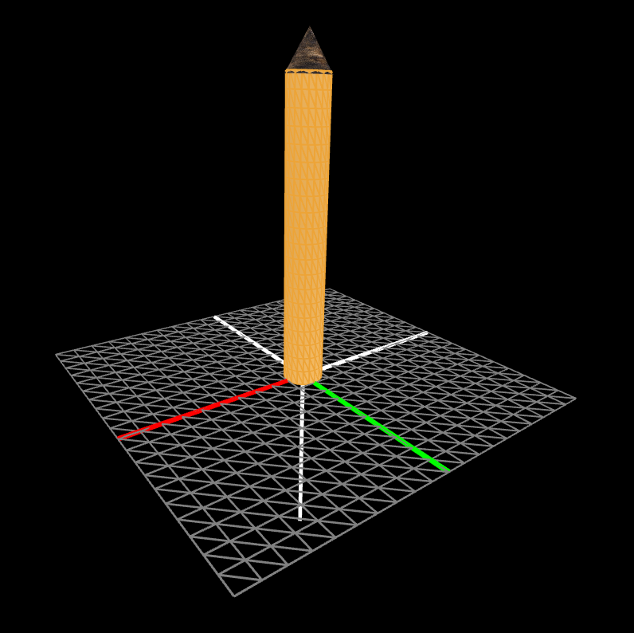

Hannah '22:
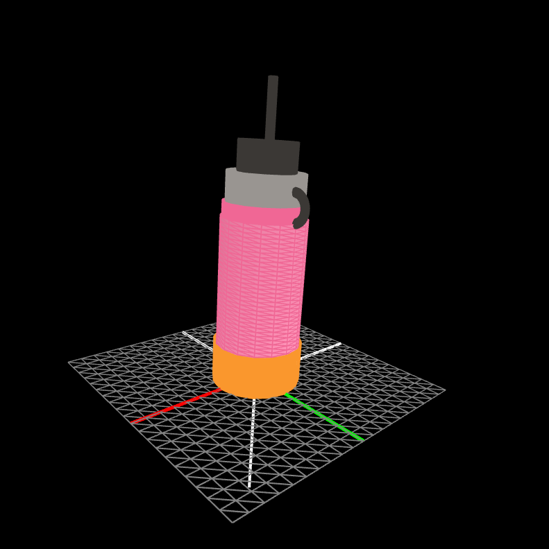

Julianne '22:
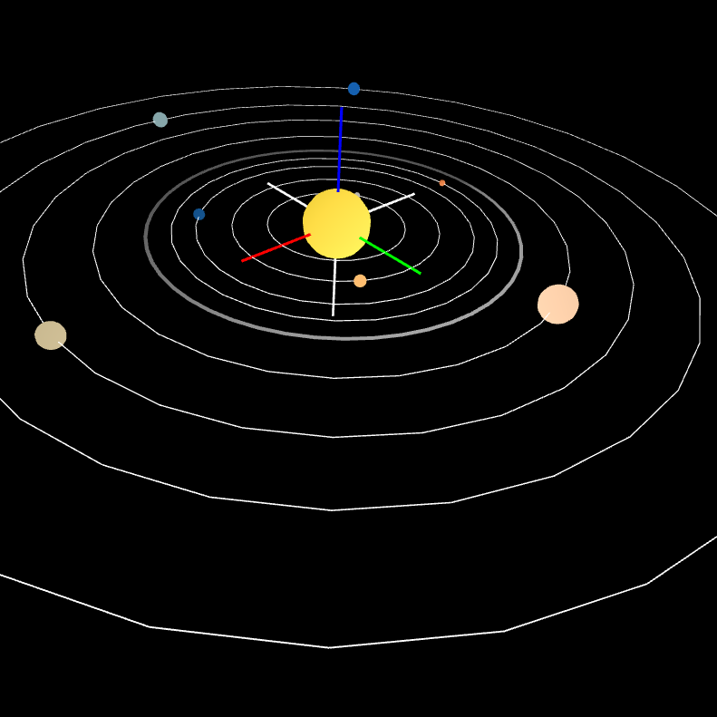

Layla '22:
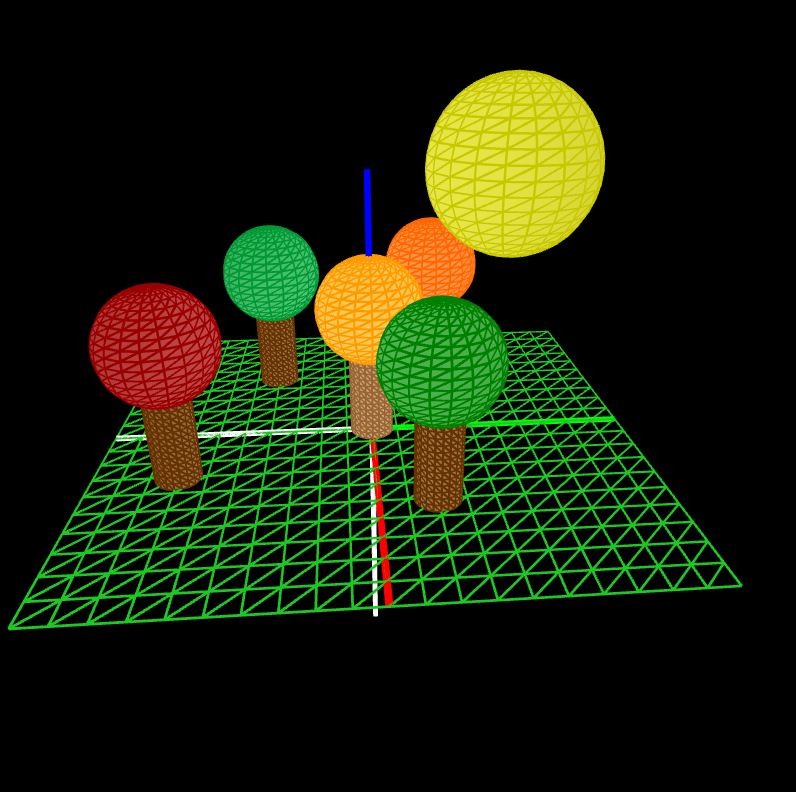

Maisie '22:
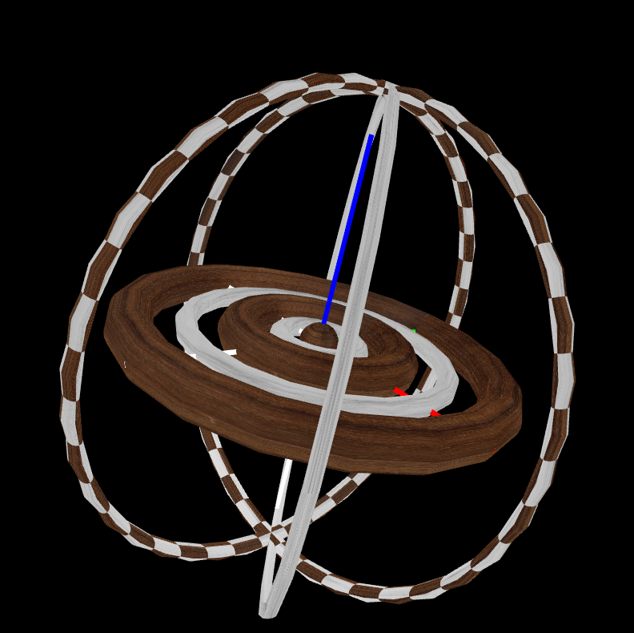

Neve '22:
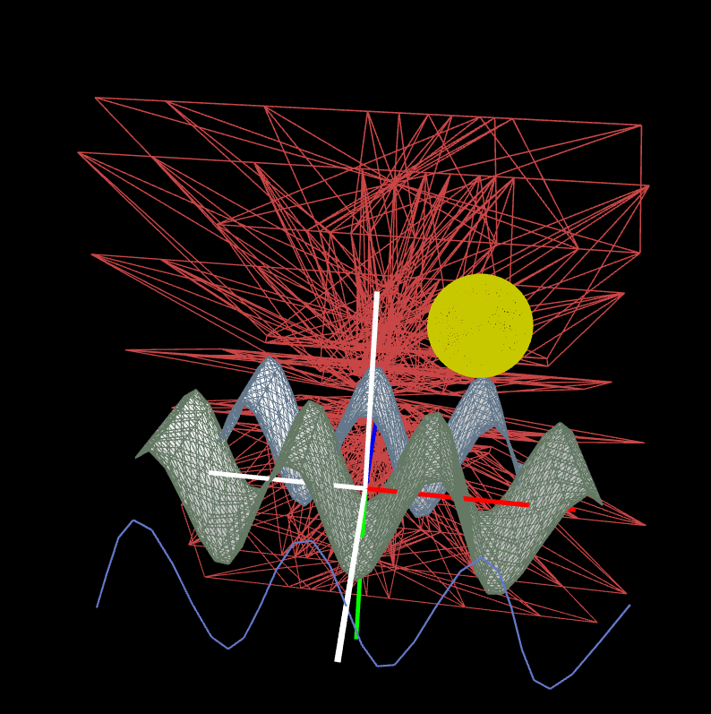

Sadie '22:
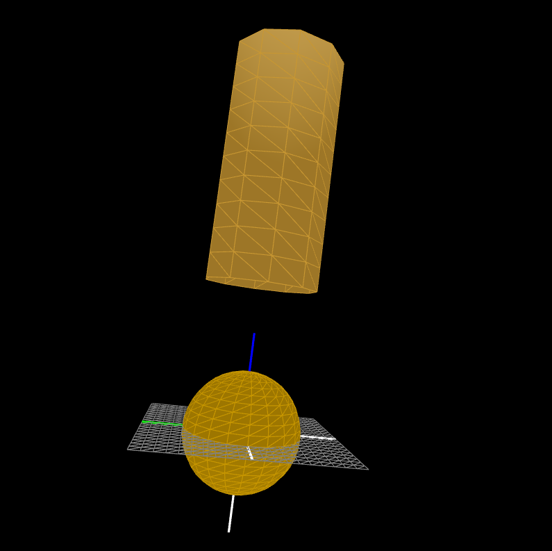

Shine '22:
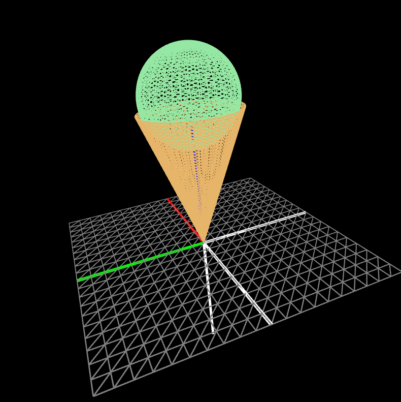

