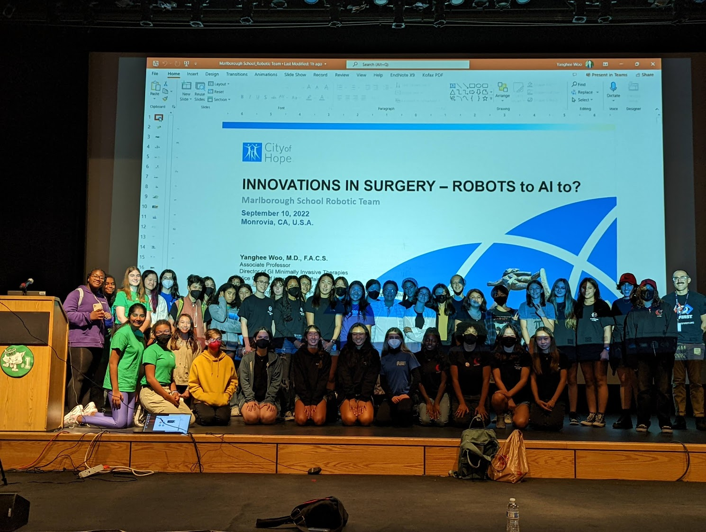
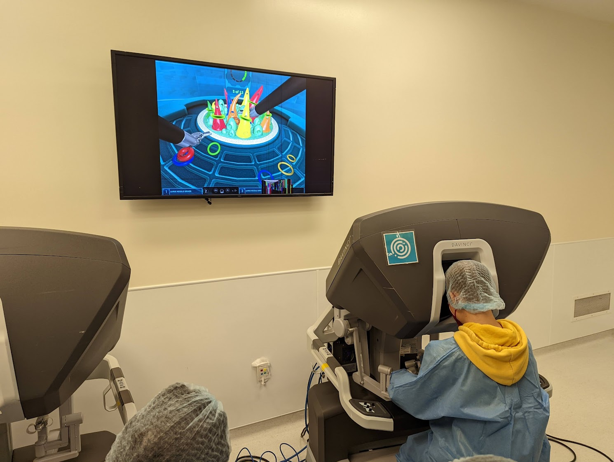

On Saturday September 10th, the FIRST Tech Challenge Season officially kicked off in with the release of this season's game; PowerPlay. Members from all five of Marlborough's teams traveled to Monrovia for the reveal of the game field and workshops on various aspects of the competition. **Team Curiosity** ran a hugely popular workshop on their award winning engineering portfolios from the past two seasons.

Next the teams heard a presentation from world renowned surgeon **Dr. Yanghee Woo** on the history, present and future of surgical robots. Dr. Woo is the director of Gastroenterology Minimally Invasive Therapy at City of Hope hospital. She taught the teams how this amazing robotic surgery technology has made procedures easier for surgeons and improved recovery times for patients.

After the presentation, the teams traveled to **City of Hope** to try the **Intuitive Da Vinci** surgical robots first hand! Dr. Woo set up a 'dry lab' that allowed students to manipulate the machines and try their hands at precise movements. It was amazing to see the vision and control that that the surgeon has with the instruments. Many students left inspired by this impressive real-world application of robotic technology.

To learn more about this year's game and Dr. Woo, check out the links below!

## **Quick Links**
[PowerPlay Game Video](https://www.youtube.com/watch?v=HsitvZ0JaDc)

[Dr. Yanghee Woo Bio](https://www.cityofhope.org/yanghee-woo)

[Intuitive Da Vinci Website](https://www.intuitive.com/en-us/products-and-services/da-vinci)
