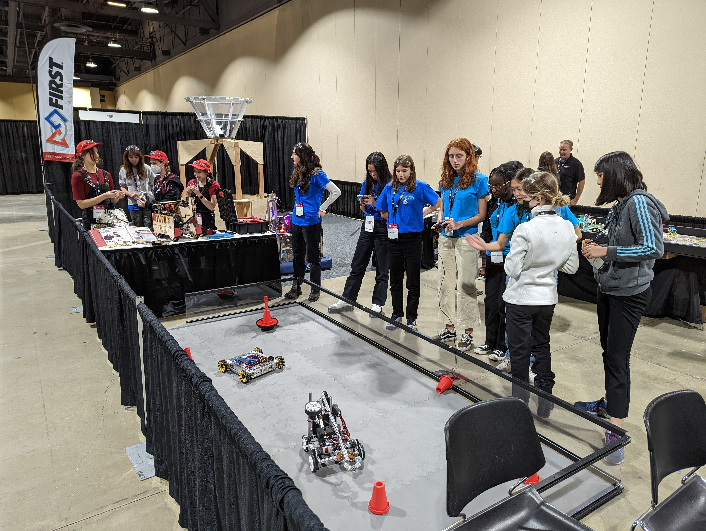

On November 4 and 5th, Marlborough Robotics descended on the Long Beach Convention center to experience the finals for the **ANA Avatar XPRIZE competition**. The event featured 17 finalist teams from all around the world, competing for $10 million in prize money. The goal is "to create an avatar system that can transport human presence to a remote location in real time." To give the human judge a completely immersive experience, the teams utilized a mixture of robotics, virtual reality, haptic feedback, and artificial intelligence.

To test and assess the systems, the human judges had to remotely operate the robots through a series of challenging tasks that pushed the limits of their sensory capabilities. This part of the competition took place in an arena like setting. In this photo, the robot is attempting to manipulate a drill to remove a bolt from the wall. You can see an image of the human operator in the top right of the frame.

In addition to the competition, there was also a fair that allowed visitors to experience many of the competition technologies firsthand. Some of the highlights;

At the JPL booth, students used Microsoft Hololens Augmented Reality headsets to view and explore a life sized computer model of the Mars Perseverance Rover.

At the UCLA RoMeLa Lab booth, students saw demos of a variety of robotics with different locomotion technologies. There were bipedal bots, some with spider legs, and others that bounced while suspended from a balloon!

At the AI Life booth, students conversed with a human like robot that had natural language capability. It did its best to answer questions posed by the students.

At the Haption booth, students manipulated objects using a robotic arm controlled by an intuitive haptic feedback system.

At the Senseglove booth, students used a combination of virtual reality goggles and haptic feedback gloves to manipulate objects and complete tasks in a virtual environment.

The students even bumped into a Marlborough alumna who works for the XPRIZE competition!

Back at the FIRST Robotics Booth, the Marlborough teams demoed their own robots and taught visitors about the FIRST Tech Challenge Competition. **Team Curiosity's** engineering portfolio was of great interest to many of the attendees. The UCLA Lab as well as some XPRIZE teams specifically sent their grad students over to take a look.

To learn more about the event, check out the links below!

## **Quick Links**
[Avatar XPRIZE Home Page](https://www.xprize.org/prizes/avatar)

[Google Photo Album](https://photos.app.goo.gl/GXNKyvUwrJ3QybDF7)
